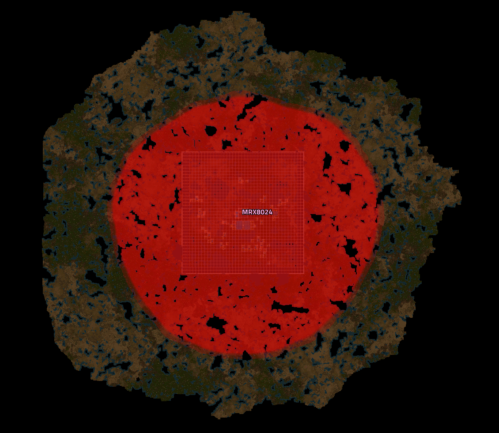
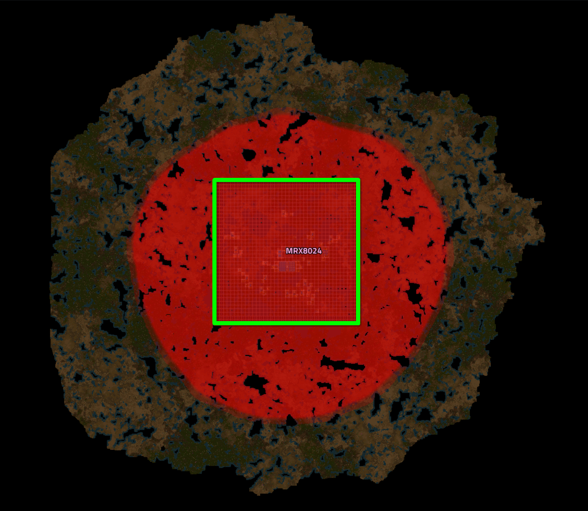
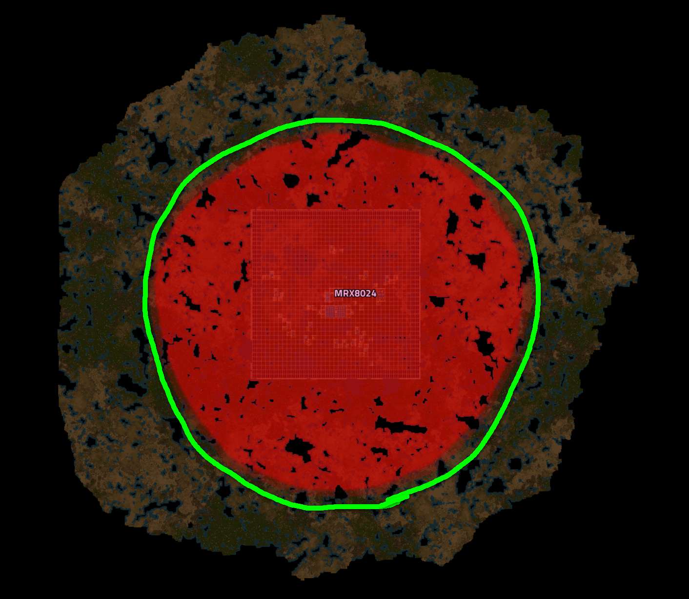
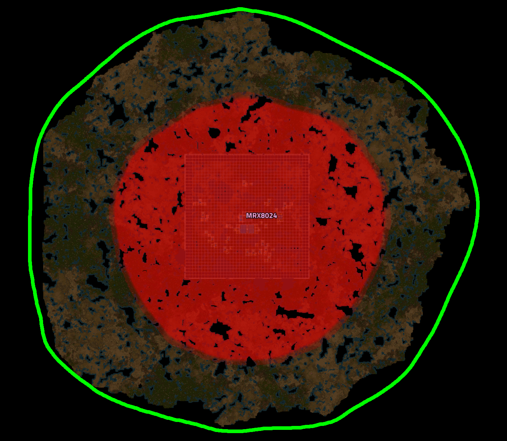
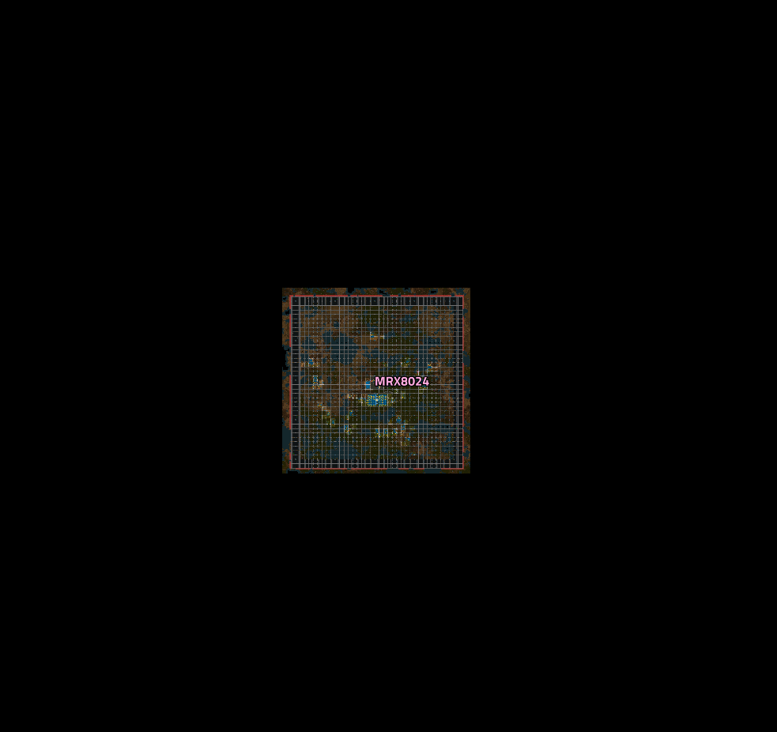
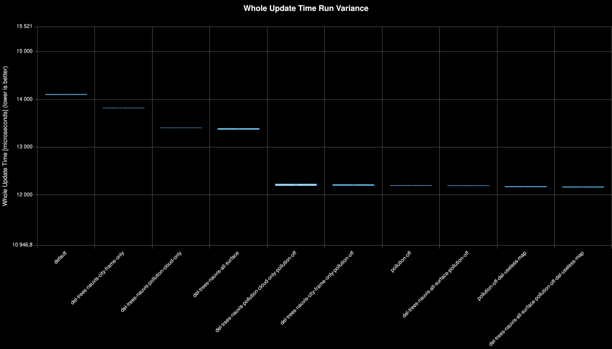
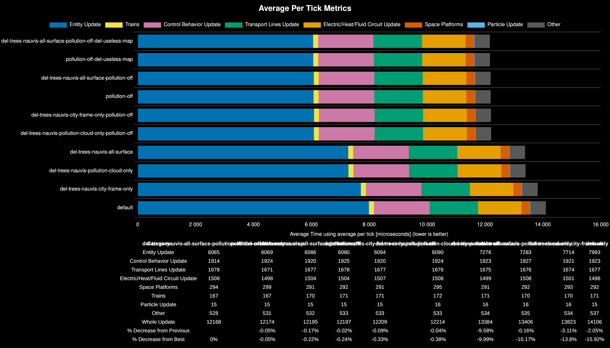

# Impact of pollution on the Nauvis surface

## Hardware
- **CPU:** Intel Core i7-12700KF; E-Cores disabled; 4.5GHz fixed
- **RAM:** F4-3600C18D-64GTRS DDR4-4x32GB-3300MHz
- **Platform:** Ubuntu 24.04.4 LTS x64
- **Mimalloc lib:** Enabled
- **Hugepages:** Disabled (savefiles exceed 16GB Mimalloc limit, better turn it off)
- **Factorio Version:** 2.0.76
- **Date:** 2026-04-12

## The Question
- How much does pollution affect update time?
- How much do trees affect update time due to pollution filtering?
- Do trees affect update time even if they are outside the pollution zone?
- Does map size affect update time? Will removing extra empty chunks improve performance?

## Conclusion
- Pollution has a significant impact, taking up to ~16% of a full savefile update time.
- Trees have a noticeable impact on update time when they are within the pollution area, removing trees gave +6% improvement.
- Removing a large number of trees outside the pollution cloud gave minimal improvements, +0.20%.
- Removing a large number of empty chunks from the map gave minimal improvements, +0.20%. (~0.5 GB reduction in savefile size)

## Scenario

- Each save was tested for 108000 tick(s) and 20 run(s)
- A savefile of a real megabase with 7.5M espm, which is constantly researching bots speed. Gleba is effectively
inactive, with a small pollution cloud that can be ignored. All savefiles are synchronized by ticks.
- Save files:
  - `default`: default map without any modifications
  
  
  
  - `del-trees-nauvis-city-frame-only`: remove trees in the cityblocks area
  
  
  
  - `del-trees-nauvis-pollution-cloud-only`: remove trees in an area slightly larger than the pollution area
  
  

  - `del-trees-nauvis-all-surface`: remove trees from the all surface area
  
  

  The same samples but with pollution completely disabled
  - `pollution-off`
  - `del-trees-nauvis-city-frame-only-pollution-off`
  - `del-trees-nauvis-pollution-cloud-only-pollution-off`
  - `del-trees-nauvis-all-surface-pollution-off`

  Disabled pollution and trimmed unnecessary extra chunks on Nauvis surface
  - `pollution-off-del-useless-map`
  - `del-trees-nauvis-all-surface-pollution-off-del-useless-map`

  

## Results
| Metric            | Description                           |
| ----------------- | ------------------------------------- |
| **Mean UPS**      | Updates per second – higher is better |
| **Mean Avg (ms)** | Average frame time – lower is better  |
| **Mean Min (ms)** | Minimum frame time – lower is better  |
| **Mean Max (ms)** | Maximum frame time – lower is better  |

| Save | Avg (ms) | Min (ms) | Max (ms) | UPS | Execution Time (ms) | % Difference from base |
|------|----------|----------|----------|-----|---------------------|------------------------|
| default | 14.107 | 12.421 | 153.825 | 70 | 3047016 | 0.00% |
| del-trees-nauvis-all-surface | 13.386 | 11.838 | 145.974 | 74 | 2891189 | 5.39% |
| del-trees-nauvis-all-surface-pollution-off | 12.194 | 10.523 | 142.676 | **82** | 2633964 | 15.68% |
| del-trees-nauvis-all-surface-pollution-off-del-useless-map | 12.167 | 10.910 | 136.194 | **82** | 2628024 | 15.94% |
| del-trees-nauvis-city-frame-only | 13.825 | 12.177 | 155.130 | 72 | 2986087 | 2.04% |
| del-trees-nauvis-city-frame-only-pollution-off | 12.208 | 10.576 | 151.523 | 81 | 2636986 | 15.55% |
| del-trees-nauvis-pollution-cloud-only | 13.407 | 11.811 | 146.968 | 74 | 2895929 | 5.22% |
| del-trees-nauvis-pollution-cloud-only-pollution-off | 12.213 | 10.651 | 144.052 | 81 | 2638142 | 15.50% |
| pollution-off | 12.197 | 10.649 | 147.779 | 81 | 2634585 | 15.65% |
| pollution-off-del-useless-map | 12.173 | 10.869 | 141.339 | **82** | 2629317 | 15.89% |

